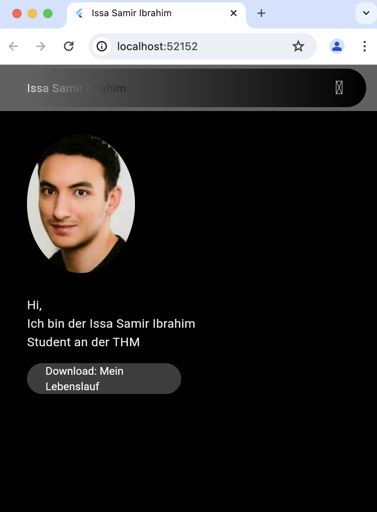

create portflio_5497122 email: issa.samir.ibrahim@mnd.thm.de 4. Installation der Entwicklungsumgebung Installiere Flutter auf Deinem Computer. Folge der offiziellen Installationsanleitung auf der Flutter Webseite. Stelle sicher, dass die Flutter-Umgebung richtig konfiguriert ist, indem Du den Befehl flutter doctor im Terminal ausführst. Korrigiere eventuelle Fehler oder fehlende Komponenten, bis der Befehl keine relevanten Fehler mehr anzeigt. 2. Einrichtung des Git-Repositories Erstelle ein neues Repository auf GitHub, GitLab oder einer ähnlichen Plattform. Der Name des Repositories muss portfolio_ sein, wobei durch Deine Matrikelnummer zu ersetzen ist. Lade mich per E-Mail in Dein Git-Repository ein. Verwende dazu die E-Mail-Adresse des Dozenten. 3. Erstellung einer README-Datei und Initialisierung des Flutter-Projekts Füge im Hauptverzeichnis Deines Repositories eine README.md Datei hinzu. Diese sollte eine kurze Beschreibung des Projektes sowie Anweisungen zur Installation und Ausführung enthalten. Initialisiere innerhalb des Repositories ein neues Flutter-Projekt mit dem Namen portfolio_ . Verwende dazu den Befehl: flutter create portfolio_

So sieht die die Homepageseite auf google aus.

so sieht die homepagesiete auf ios aus und das als webansicht

Hier sind meine Fhigkeiten zu sehen. Nämlich in telefonansicht.

Hier ist dieselbe ansichht zu betrachten, lediglich ist hier die Kontakt Feld zu sehen.

Die Startseite, wie sie im Handy aussehen wird

Hier ist der Drawer (so wird er in Flutter bezeichnet), sprich die Menüleiste zu sehen, mit den entsprechenden Sektionen.
Beim draufklicken der jeweiligeen Sektion, wird mna automatsch zu dem jeweiligen Bereich geschickt 

Die beiden Bilder zeigen, dass zuvor beschriebene als Webansicht an, lediglich ist der einzige Unterschied, dass wir keine Menüleiste mehr haben (Drawer) ,s dnern obene die ganzen Sektioenen stehen, aufgereiht stehen und ebenfalls draufgeklickt werden kann und diese einen in den enstprechenden Bereich hinschicken
